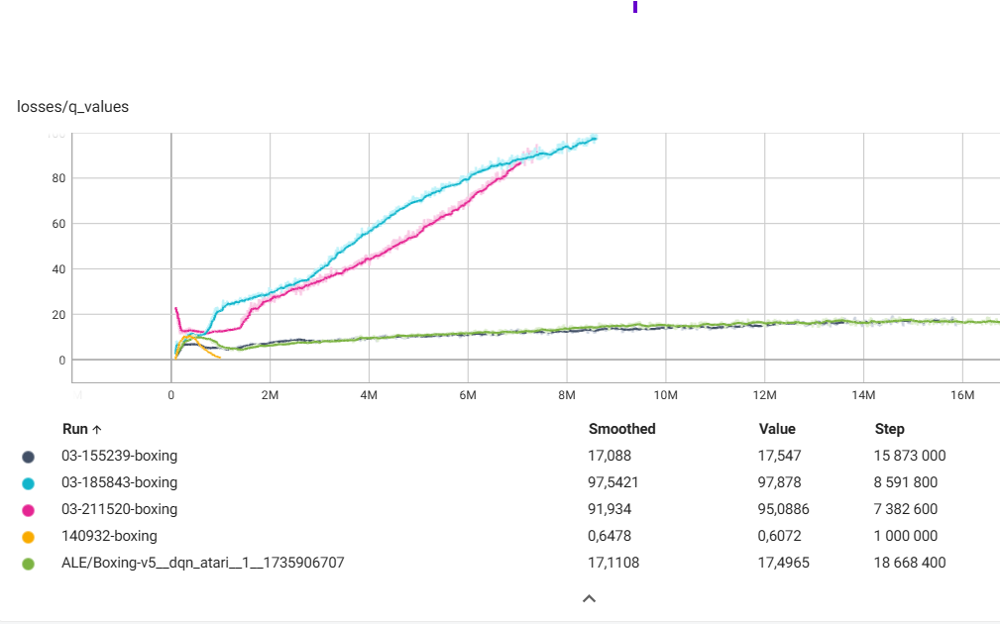

# Boxing-RL-DQN
Simple reinforcement  learning DQN algorithm for Boxing Atari Game

### Installation

_Below is an example of how you can instruct your audience on installing and setting up your app. This template doesn't rely on any external dependencies or services._

1. Clone the repo
   ```sh
   git clone https://github.com/1mbili/Boxing-RL-DQN.git
   ```
2. Install requirements
   ```sh
    python3 -m pip install -r requirements.txt
   ```
3. Change appropriate parameters in algorithm file 
   ```sh
    DQN.py
   ```

   
## Usage
run the following command to start the training
   ```sh
    python3 DQN.py
   ```

On other terminal you can launch tensorboard to monitor the training process
   ```sh
    tensorboard --logdir=runs/
   ```

### Results
Reinforcement learning is very sensitive for hyperparameters, so you may need to change the hyperparameters to get better results. Below is the result of trainings with different hyperparameters.

